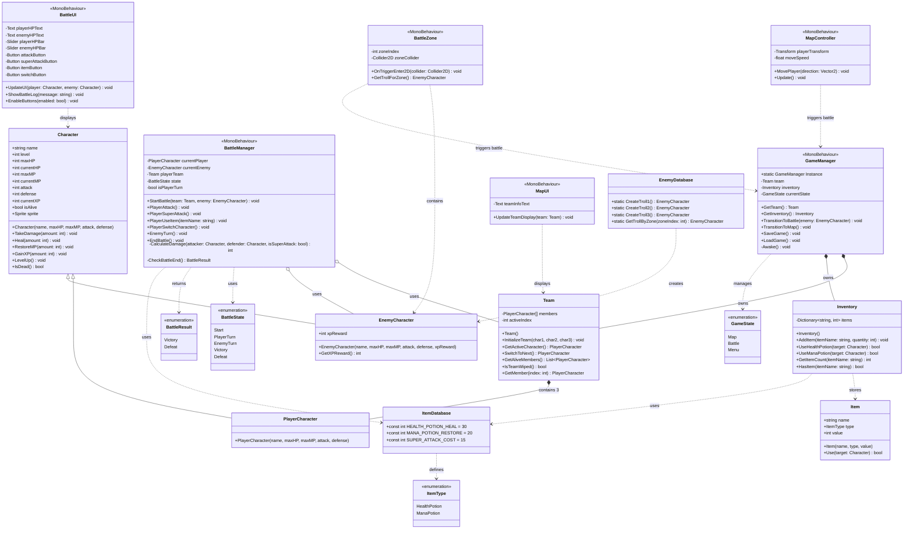

# UniQuest - Simplified Class Diagram (2-Week MVP)

---

## Mermaid Class Diagram



---

## Simplified Design Overview

**Total Classes: 15**
**Development Time: 2 weeks**  


This design removes:
- ❌ CharacterType system (no elemental types)
- ❌ Complex attack system (just Attack and Super Attack)
- ❌ ScriptableObjects (hardcoded data instead)
- ❌ Complex AI (simple random enemy actions)
- ❌ Multiple item types (just 2 potions)
- ❌ Separate calculator classes
- ❌ Save/load serialization (simplified or optional)

This design keeps:
- ✅ 3-character fixed team
- ✅ Turn-based 1v1 combat
- ✅ Basic inventory (2 potion types)
- ✅ HP/MP/XP/Leveling
- ✅ Clear separation of concerns
- ✅ Easy to implement with minimal assets

---

## Detailed Class Explanations

### 1. Character (Base Class, POCO)

**Responsibilities:**  
Base class for all characters. Stores stats directly (no separate Stats class). Simple and flat.

**Key Properties:**
```csharp
public string name
public int level
public int maxHP
public int currentHP
public int maxMP
public int currentMP
public int attack       // damage scaling
public int defense      // damage reduction
public int currentXP
public bool isAlive
public Sprite sprite    // for display
```

**Important Methods:**
```csharp
public Character(string name, int maxHP, int maxMP, int attack, int defense)
public void TakeDamage(int amount)  // Reduces HP, sets isAlive = false if HP <= 0
public void Heal(int amount)        // Increases HP up to maxHP
public void RestoreMP(int amount)   // Increases MP up to maxMP
public void GainXP(int amount)      // Adds XP, auto-levels if threshold reached
public void LevelUp()               // Increases stats by 10%
public bool IsDead()                // Returns !isAlive
```

**Usage:**  
Never instantiated directly. Use PlayerCharacter or EnemyCharacter.

**Simplifications:**
- No CharacterType
- Stats stored directly (no Stats class)
- Simple level-up formula (10% stat increase)
- XP formula: `level * 100` to next level

---

### 2. PlayerCharacter (Inherits Character, POCO)

**Responsibilities:**  
Represents one of the 3 player team members.

**Methods:**
```csharp
public PlayerCharacter(string name, int maxHP, int maxMP, int attack, int defense) 
    : base(name, maxHP, maxMP, attack, defense)
```

**Usage:**  
Created at game start. Team has exactly 3 instances.

**Example initialization:**
```csharp
var warrior = new PlayerCharacter("Warrior Girl", maxHP: 100, maxMP: 30, attack: 20, defense: 10);
var vampire = new PlayerCharacter("Vampire", maxHP: 80, maxMP: 50, attack: 18, defense: 8);
var mage = new PlayerCharacter("Mage", maxHP: 70, maxMP: 60, attack: 25, defense: 5);
```

---

### 3. EnemyCharacter (Inherits Character, POCO)

**Responsibilities:**  
Represents an enemy. Includes XP reward.

**Additional Properties:**
```csharp
public int xpReward
```

**Methods:**
```csharp
public EnemyCharacter(string name, int maxHP, int maxMP, int attack, int defense, int xpReward) 
    : base(name, maxHP, maxMP, attack, defense)
public int GetXPReward()
```

**Usage:**  
Created by EnemyDatabase static factory methods.

---

### 4. Team (POCO)

**Responsibilities:**  
Manages the 3-member party. Tracks active character and alive members.

**Key Properties:**
```csharp
private PlayerCharacter[] members = new PlayerCharacter[3];
private int activeIndex = 0;
```

**Methods:**
```csharp
public Team()
public void InitializeTeam(PlayerCharacter char1, PlayerCharacter char2, PlayerCharacter char3)
public PlayerCharacter GetActiveCharacter()
public PlayerCharacter SwitchToNext() // Switch to next alive character
public List<PlayerCharacter> GetAliveMembers()
public bool IsTeamWiped() // All 3 dead = game over
public PlayerCharacter GetMember(int index)
```

**Usage:**  
Owned by GameManager. Used by BattleManager to manage active fighter and switches.

**Simplification:**  
Fixed array of 3 instead of dynamic list. No max size logic needed.

---

### 5. Item (POCO)

**Responsibilities:**  
Simplified item representation. No inheritance needed.

**Properties:**
```csharp
public string name
public ItemType type
public int value // healing amount or mana amount
```

**Methods:**
```csharp
public Item(string name, ItemType type, int value)
public bool Use(Character target)
```

**Usage:**  
Used by Inventory. Only 2 types: HealthPotion, ManaPotion.

**Simplification:**  
No abstract Item class with multiple subclasses. Just one simple class with type enum.

---

### 6. Inventory (POCO)

**Responsibilities:**  
Stores items by name and quantity. Simple dictionary.

**Key Properties:**
```csharp
private Dictionary<string, int> items = new Dictionary<string, int>();
```

**Methods:**
```csharp
public Inventory()
public void AddItem(string itemName, int quantity)
public bool UseHealthPotion(Character target) // Uses "HealthPotion", heals 30 HP
public bool UseManaPotion(Character target)   // Uses "ManaPotion", restores 20 MP
public int GetItemCount(string itemName)
public bool HasItem(string itemName)
```

**Usage:**  
Owned by GameManager. Accessed during battle for item use.

**Simplification:**
- No complex Item objects, just string names
- Hardcoded potion effects
- No max capacity (infinite for MVP)

**Initial inventory:**
```csharp
inventory.AddItem("HealthPotion", 5);
inventory.AddItem("ManaPotion", 3);
```

---

### 7. BattleManager (MonoBehaviour)

**Responsibilities:**  
Orchestrates combat. Handles player actions, enemy actions, damage calculation, and battle end.

**Key Properties:**
```csharp
private PlayerCharacter currentPlayer;
private EnemyCharacter currentEnemy;
private Team playerTeam;
private BattleState state;
private bool isPlayerTurn = true;
```

**Methods:**
```csharp
public void StartBattle(Team team, EnemyCharacter enemy) // Initialize battle
public void PlayerAttack()      // Normal attack (free)
public void PlayerSuperAttack() // Costs 15 MP, deals 2x damage
public void PlayerUseItem(string itemName) // Use potion
public void PlayerSwitchCharacter() // Switch to next alive member
public void EnemyTurn() // Enemy attacks (50% normal, 50% super if has MP)
public void EndBattle() // Cleanup and return to map
private int CalculateDamage(Character attacker, Character defender, bool isSuperAttack)
private BattleResult CheckBattleEnd() // Check for victory/defeat
```

**Damage Formula (simple):**
```csharp
int baseDamage = attacker.attack - (defender.defense / 2);
if (isSuperAttack) baseDamage *= 2;
int randomVariance = Random.Range(-3, 4); // ±3 variance
return Mathf.Max(1, baseDamage + randomVariance); // At least 1 damage
```

**Usage:**  
Attached to Battle scene GameObject. Controlled by UI button clicks.

**Simplifications:**
- No turn order system (always player first, no speed stat needed)
- No attack miss chance (always hits)
- No critical hits
- Simple enemy AI (random attack choice)
- Damage formula is one method (no separate calculator class)

---

### 8. MapController (MonoBehaviour)

**Responsibilities:**  
Handles player movement on map. No encounter logic needed (handled by BattleZone).

**Key Properties:**
```csharp
private Transform playerTransform; // Reference to player's Transform component
private float moveSpeed = 5f; // How fast player moves
```

**Methods:**
```csharp
public void MovePlayer(Vector2 direction) // Moves player based on input
public void Update() // Called every frame, handles input
```

**Movement Logic (simple):**
```csharp
void Update() {
    Vector2 input = Vector2.zero;
    if (Input.GetKey(KeyCode.UpArrow)) input.y += 1;
    if (Input.GetKey(KeyCode.DownArrow)) input.y -= 1;
    if (Input.GetKey(KeyCode.LeftArrow)) input.x -= 1;
    if (Input.GetKey(KeyCode.RightArrow)) input.x += 1;
    
    if (input != Vector2.zero) {
        playerTransform.Translate(input * moveSpeed * Time.deltaTime);
    }
}
```

**Usage:**  
Attached to Map scene. Handles only movement - battles triggered by BattleZone collision.

**Simplifications:**
- No step counting or encounter logic
- No tilemap collision checking (free movement or simple bounds)
- No NPCs or chests (optional stretch goal)
- Battles handled by separate BattleZone components

---

### 8b. BattleZone (MonoBehaviour)

**Responsibilities:**  
Triggers battles when player enters the zone. Contains possible enemies for this zone.

**Key Properties:**
```csharp
private int zoneIndex; // Which troll this zone contains (0, 1, or 2)
private Collider2D zoneCollider; // The trigger collider for this zone
```

**Methods:**
```csharp
public void OnTriggerEnter2D(Collider2D collider) // Unity callback when player enters
public EnemyCharacter GetTrollForZone() // Get specific troll for this zone
```

**Battle Trigger Logic:**
```csharp
void OnTriggerEnter2D(Collider2D other) {
    if (other.CompareTag("Player")) {
        var troll = GetTrollForZone();
        GameManager.Instance.TransitionToBattle(troll);
    }
}

public EnemyCharacter GetTrollForZone() {
    return EnemyDatabase.GetTrollByZone(zoneIndex);
}
```

**Usage:**  
Attached to empty GameObjects with Collider2D (set as Trigger). Each zone has a specific troll.

**Setup in Unity:**
1. Create empty GameObject
2. Add Collider2D, set as Trigger
3. Add BattleZone script
4. Set `zoneIndex` in Inspector (0, 1, or 2)
5. Place 3 zones on map (one for each troll)

**Zone Examples:**
- **Zone 0:** Troll1 (Easy) - zoneIndex = 0
- **Zone 1:** Troll2 (Medium) - zoneIndex = 1  
- **Zone 2:** Troll3 (Hard) - zoneIndex = 2

---

### 9. GameManager (MonoBehaviour, Singleton)

**Responsibilities:**  
Central hub. Owns Team and Inventory. Manages scene transitions.

**Key Properties:**
```csharp
public static GameManager Instance;
private Team team;
private Inventory inventory;
private GameState currentState;
```

**Methods:**
```csharp
private void Awake() // Singleton setup, DontDestroyOnLoad
public Team GetTeam()
public Inventory GetInventory()
public void TransitionToBattle(EnemyCharacter enemy) // Load battle scene
public void TransitionToMap() // Load map scene
public void SaveGame() // Optional: PlayerPrefs simple save
public void LoadGame() // Optional: PlayerPrefs simple load
```

**Initialization (in Awake or Start):**
```csharp
team = new Team();
team.InitializeTeam(
    new PlayerCharacter("Warrior Girl", 100, 30, 20, 10, 5),
    new PlayerCharacter("Vampire", 80, 50, 18, 8, 7),
    new PlayerCharacter("Mage", 70, 60, 25, 5, 6)
);
inventory = new Inventory();
inventory.AddItem("HealthPotion", 5);
inventory.AddItem("ManaPotion", 3);
```

**Usage:**  
Accessed via `GameManager.Instance` from any scene.

**Simplifications:**
- No complex save system (use PlayerPrefs for MVP or skip entirely)
- Hardcoded team initialization
- Simple scene management (no loading screens)

---

### 10. BattleUI (MonoBehaviour)

**Responsibilities:**  
Displays battle info and handles button inputs.

**Key Properties:**
```csharp
public Text playerHPText;
public Text enemyHPText;
public Slider playerHPBar;
public Slider enemyHPBar;
public Button attackButton;
public Button superAttackButton;
public Button itemButton;
public Button switchButton;
public Text battleLog; // Shows messages like "Warrior attacked for 15 damage!"
```

**Methods:**
```csharp
public void UpdateUI(Character player, Character enemy)
public void ShowBattleLog(string message)
public void EnableButtons(bool enabled) // Disable during enemy turn
```

**Usage:**  
Attached to Canvas in Battle scene. Calls BattleManager methods on button clicks.

**Button Handlers:**
```csharp
void OnAttackButtonClick() {
    battleManager.PlayerAttack();
}
```

---

### 11. MapUI (MonoBehaviour)

**Responsibilities:**  
Displays team info on map (optional, can be minimal).

**Methods:**
```csharp
public void UpdateTeamDisplay(Team team) // Show HP bars or text for 3 characters
```

**Usage:**  
Attached to Canvas in Map scene.

**Simplification:**  
Could be as simple as 3 text fields showing "Warrior: 85/100 HP".

---

### 12. EnemyDatabase (Static Utility Class)

**Responsibilities:**  
Factory for creating the 3 specific trolls. No random enemies, no ScriptableObjects needed.

**Methods:**
```csharp
public static EnemyCharacter CreateTroll1() {
    return new EnemyCharacter("Troll1", maxHP: 40, maxMP: 15, attack: 12, defense: 5, xpReward: 25);
}

public static EnemyCharacter CreateTroll2() {
    return new EnemyCharacter("Troll2", maxHP: 60, maxMP: 20, attack: 16, defense: 8, xpReward: 40);
}

public static EnemyCharacter CreateTroll3() {
    return new EnemyCharacter("Troll3", maxHP: 80, maxMP: 25, attack: 20, defense: 12, xpReward: 60);
}

public static EnemyCharacter GetTrollByZone(int zoneIndex) {
    switch(zoneIndex) {
        case 0: return CreateTroll1(); // Easy troll
        case 1: return CreateTroll2(); // Medium troll  
        case 2: return CreateTroll3(); // Hard troll
        default: return CreateTroll1(); // Fallback
    }
}
```

**Usage:**  
Called by BattleZone when player enters a zone.

**Simplification:**  
3 specific trolls instead of random enemies. Each zone has one troll. Much simpler to balance and test.

---

### 13. ItemDatabase (Static Constants)

**Responsibilities:**  
Defines item values as constants.

**Constants:**
```csharp
public const int HEALTH_POTION_HEAL = 30;
public const int MANA_POTION_RESTORE = 20;
public const int SUPER_ATTACK_COST = 15;
```

**Usage:**  
Referenced by Inventory and BattleManager.

---

## Enumerations

### ItemType
```csharp
public enum ItemType {
    HealthPotion,
    ManaPotion
}
```

### BattleState
```csharp
public enum BattleState {
    Start,
    PlayerTurn,
    EnemyTurn,
    Victory,
    Defeat
}
```

### GameState
```csharp
public enum GameState {
    Map,
    Battle,
    Menu
}
```

### BattleResult
```csharp
public enum BattleResult {
    Victory,
    Defeat
}
```

---

## Architecture Summary

### MonoBehaviour Classes (Unity-dependent)
1. **GameManager** – Singleton, scene management
2. **BattleManager** – Combat controller
3. **MapController** – Movement and encounters
4. **BattleUI** – Battle interface
5. **MapUI** – Map interface

### POCO Classes (Pure C#, testable)
1. **Character** – Base character logic
2. **PlayerCharacter** – Player subclass
3. **EnemyCharacter** – Enemy subclass
4. **Team** – Party management
5. **Inventory** – Item storage
6. **Item** – Simple item data

### Static Utility Classes
1. **EnemyDatabase** – Enemy factory
2. **ItemDatabase** – Constants

### Total: ~13 classes + 4 enums

---

## Removed Complexity

| Feature | Original Design | Simplified Design |
|---------|----------------|-------------------|
| Character types | 7 types + effectiveness | None (just 3 unique characters) |
| Attack system | Multiple attacks per character | Just Attack + Super Attack |
| Item system | 4 item types with inheritance | 2 potion types, no inheritance |
| Stats | Separate Stats class | Stats as direct fields |
| Data assets | ScriptableObjects | Hardcoded in static classes |
| AI system | 4 AI behaviors | Random 50/50 attack choice |
| Combat | Turn order, miss chance, crits | Always player first, always hit |
| Damage calc | Separate DamageCalculator class | One method in BattleManager |
| Save system | Full JSON serialization | PlayerPrefs or skip for MVP |
| Leveling | Complex stat growth | Simple 10% increase |

---

## 2-Week Implementation Plan

### Week 1: Core Systems (No UI)

#### Day 1-2: Character & Team
- [ ] Create Character, PlayerCharacter, EnemyCharacter classes
- [ ] Implement TakeDamage, Heal, GainXP, LevelUp
- [ ] Create Team class with 3-character management
- [ ] **Test in Unity console:** Create team, damage characters, check IsTeamWiped()

#### Day 3-4: Combat Logic
- [ ] Create BattleManager (without UI, use Debug.Log for output)
- [ ] Implement PlayerAttack, PlayerSuperAttack with damage calculation
- [ ] Implement EnemyTurn with random attack choice
- [ ] Implement CheckBattleEnd logic
- [ ] **Test:** Run battle via manual method calls, verify damage and win/loss

#### Day 5: Inventory & Items
- [ ] Create Inventory class
- [ ] Implement UseHealthPotion, UseManaPotion
- [ ] Create EnemyDatabase and ItemDatabase
- [ ] **Test:** Use items, verify HP/MP changes

#### Day 6-7: Map & Battle Zones
- [ ] Create MapController with basic movement
- [ ] Create BattleZone script and prefab
- [ ] Create 3 trolls in EnemyDatabase (Troll1, Troll2, Troll3)
- [ ] Place 3 battle zones on map (one per troll)
- [ ] Create GameManager singleton
- [ ] **Test:** Walk into zones, fight specific trolls

### Week 2: Unity Integration & Polish

#### Day 8-9: Battle UI
- [ ] Create Battle scene with Canvas
- [ ] Add HP bars, buttons (Attack, Super Attack, Item, Switch)
- [ ] Connect buttons to BattleManager
- [ ] Add battle log text
- [ ] **Test:** Play full battle with UI

#### Day 10-11: Map Scene
- [ ] Create Map scene with simple tilemap or sprite background
- [ ] Add player sprite and movement controls (arrow keys)
- [ ] Add MapUI showing team HP
- [ ] Implement scene transitions (Map ↔ Battle)
- [ ] **Test:** Walk, encounter enemy, win battle, return to map

#### Day 12-13: Balance & Polish
- [ ] Playtest and adjust enemy stats
- [ ] Adjust damage formula for fun balance
- [ ] Add sprite assets (player characters, enemies)
- [ ] Add simple sound effects (optional)
- [ ] Add game over screen
- [ ] Add victory screen

#### Day 14: Final Testing & Presentation
- [ ] Full playthrough test
- [ ] Fix critical bugs
- [ ] Prepare demo for presentation
- [ ] Create simple README with controls

---

## Minimal Asset Requirements

### Sprites Needed (8 total)
- 3 player character sprites (Warrior Girl, Vampire, Mage)
- 3 troll sprites (Troll1, Troll2, Troll3) - can be same sprite with different colors
- 2 item icons (Health Potion, Mana Potion)
- 1 map background or tileset
- 4 UI elements (buttons, health bar, etc. - can use Unity defaults)

### Scenes (2)
1. Map scene
2. Battle scene

### Audio (Optional)
- 3 sound effects (attack, hit, level up)
- 1 background music track

---

## Testing Strategy (Simplified)

### Unit Tests (Optional but Recommended)
```csharp
// Character Tests
[Test] public void TakeDamage_ReducesHP() { ... }
[Test] public void Heal_DoesNotExceedMaxHP() { ... }
[Test] public void GainXP_TriggersLevelUp() { ... }

// Team Tests
[Test] public void IsTeamWiped_WhenAllDead_ReturnsTrue() { ... }
[Test] public void SwitchToNext_SkipsDeadCharacters() { ... }

// Inventory Tests
[Test] public void UseHealthPotion_HealsAndRemovesItem() { ... }
```

### Manual Testing Checklist
- [ ] Can move on map
- [ ] Random encounters trigger
- [ ] All 4 battle actions work (Attack, Super Attack, Item, Switch)
- [ ] Character switching works when one dies
- [ ] Game over when team wiped
- [ ] Victory gives XP
- [ ] Leveling increases stats
- [ ] Potions work correctly
- [ ] MP depletes and regenerates

---

## Code Example: Minimal BattleManager

```csharp
public class BattleManager : MonoBehaviour {
    private PlayerCharacter currentPlayer;
    private EnemyCharacter currentEnemy;
    private Team playerTeam;
    public BattleUI ui;
    
    public void StartBattle(Team team, EnemyCharacter enemy) {
        playerTeam = team;
        currentPlayer = team.GetActiveCharacter();
        currentEnemy = enemy;
        ui.UpdateUI(currentPlayer, currentEnemy);
    }
    
    public void PlayerAttack() {
        int damage = CalculateDamage(currentPlayer, currentEnemy, false);
        currentEnemy.TakeDamage(damage);
        ui.ShowBattleLog($"{currentPlayer.name} attacked for {damage} damage!");
        ui.UpdateUI(currentPlayer, currentEnemy);
        
        if (CheckBattleEnd() == BattleResult.Victory) {
            EndBattle();
            return;
        }
        
        EnemyTurn();
    }
    
    public void PlayerSuperAttack() {
        if (currentPlayer.currentMP < ItemDatabase.SUPER_ATTACK_COST) {
            ui.ShowBattleLog("Not enough MP!");
            return;
        }
        
        currentPlayer.currentMP -= ItemDatabase.SUPER_ATTACK_COST;
        int damage = CalculateDamage(currentPlayer, currentEnemy, true);
        currentEnemy.TakeDamage(damage);
        ui.ShowBattleLog($"{currentPlayer.name} used Super Attack for {damage} damage!");
        ui.UpdateUI(currentPlayer, currentEnemy);
        
        if (CheckBattleEnd() == BattleResult.Victory) {
            EndBattle();
            return;
        }
        
        EnemyTurn();
    }
    
    public void PlayerUseItem(string itemName) {
        var inventory = GameManager.Instance.GetInventory();
        bool success = false;
        
        if (itemName == "HealthPotion") {
            success = inventory.UseHealthPotion(currentPlayer);
            if (success) ui.ShowBattleLog($"Used Health Potion! Healed {ItemDatabase.HEALTH_POTION_HEAL} HP.");
        } else if (itemName == "ManaPotion") {
            success = inventory.UseManaPotion(currentPlayer);
            if (success) ui.ShowBattleLog($"Used Mana Potion! Restored {ItemDatabase.MANA_POTION_RESTORE} MP.");
        }
        
        if (!success) {
            ui.ShowBattleLog("No items available!");
            return;
        }
        
        ui.UpdateUI(currentPlayer, currentEnemy);
        EnemyTurn();
    }
    
    public void PlayerSwitchCharacter() {
        currentPlayer = playerTeam.SwitchToNext();
        ui.ShowBattleLog($"Switched to {currentPlayer.name}!");
        ui.UpdateUI(currentPlayer, currentEnemy);
        EnemyTurn();
    }
    
    public void EnemyTurn() {
        // Simple AI: 50% normal attack, 50% super attack (if has MP)
        bool useSuperAttack = Random.value > 0.5f && currentEnemy.currentMP >= ItemDatabase.SUPER_ATTACK_COST;
        
        if (useSuperAttack) {
            currentEnemy.currentMP -= ItemDatabase.SUPER_ATTACK_COST;
            int damage = CalculateDamage(currentEnemy, currentPlayer, true);
            currentPlayer.TakeDamage(damage);
            ui.ShowBattleLog($"{currentEnemy.name} used Super Attack for {damage} damage!");
        } else {
            int damage = CalculateDamage(currentEnemy, currentPlayer, false);
            currentPlayer.TakeDamage(damage);
            ui.ShowBattleLog($"{currentEnemy.name} attacked for {damage} damage!");
        }
        
        ui.UpdateUI(currentPlayer, currentEnemy);
        
        // Check if player character died
        if (currentPlayer.IsDead()) {
            if (playerTeam.IsTeamWiped()) {
                // Game Over
                ui.ShowBattleLog("Game Over!");
                // Show game over screen
            } else {
                // Force switch
                currentPlayer = playerTeam.SwitchToNext();
                ui.ShowBattleLog($"{currentPlayer.name} entered battle!");
            }
        }
    }
    
    private int CalculateDamage(Character attacker, Character defender, bool isSuperAttack) {
        int baseDamage = attacker.attack - (defender.defense / 2);
        if (isSuperAttack) baseDamage *= 2;
        int variance = Random.Range(-3, 4);
        return Mathf.Max(1, baseDamage + variance);
    }
    
    private BattleResult CheckBattleEnd() {
        if (currentEnemy.IsDead()) return BattleResult.Victory;
        if (playerTeam.IsTeamWiped()) return BattleResult.Defeat;
        return BattleResult.None; // Battle continues (you'd add this to enum)
    }
    
    private void EndBattle() {
        int xp = currentEnemy.GetXPReward();
        foreach (var member in playerTeam.GetAliveMembers()) {
            member.GainXP(xp);
        }
        ui.ShowBattleLog($"Victory! Gained {xp} XP!");
        // Wait for player input, then return to map
        GameManager.Instance.TransitionToMap();
    }
}
```

---

## FAQ for Student Developers

### Q: Do we need ScriptableObjects?
**A:** No. Hardcode enemy stats in `EnemyDatabase` static methods. Faster to implement and easier to tweak during playtesting.

### Q: How do we handle animations?
**A:** Start without animations. If time permits, add simple sprite swaps (e.g., character sprite "shakes" when hit). Use Unity Animator only if someone on team is comfortable with it.

### Q: Should we implement saving?
**A:** Optional. For MVP, restart from beginning is fine. If you want save, use `PlayerPrefs` to save HP/MP/XP/Level for 3 characters. Don't overcomplicate.

### Q: Do we need multiple attacks per character?
**A:** No. Every character has the same 2 actions: Attack and Super Attack. Differentiation comes from their stats (Warrior = high HP/defense, Mage = high attack/MP, etc.).

### Q: What about game balance?
**A:** Week 2, Day 12-13. Playtest and adjust numbers in `EnemyDatabase`. Start with easy enemies, make sure players can win some battles. Fine-tune from there.

### Q: Can we add more features later?
**A:** YES! This is MVP. After 2 weeks, if you want to add NPC dialogues, chests, more enemies, special abilities, go for it. But get MVP working first.

---

## Success Criteria for 2-Week MVP

✅ **Playable from start to finish** (move on map → encounter enemy → battle → victory/defeat)  
✅ **All 3 characters usable** (switching works)  
✅ **Combat feels functional** (damage makes sense, HP bars update)  
✅ **Items work** (potions heal/restore)  
✅ **Leveling works** (gain XP, stats increase)  
✅ **Game over condition** (team wipe shows defeat screen)  
✅ **Clean code** (readable, commented, no major bugs)  
✅ **Presentable** (can demo to instructor without crashes)

---

## Final Advice

**Week 1 Goal:** Make it WORK (logic only, ugly is fine)  
**Week 2 Goal:** Make it PLAYABLE (add Unity scenes and UI)

**Don't get stuck on:**
- Perfect art (use placeholder sprites, colored squares, or free assets)
- Complex AI (random is fine)
- Save system (nice to have, not essential)

**Focus on:**
- Core loop: Move → Battle → Win → Repeat
- Clear code structure (follow the class diagram)
- Testing as you go (don't wait until Day 14 to test)

**Team Roles (suggested for 3 people):**
- **Person A:** Character, Team, Inventory classes + unit tests
- **Person B:** BattleManager, MapController, GameManager
- **Person C:** UI (BattleUI, MapUI), scene setup, sprites

Or split by week:
- **Week 1:** Everyone focuses on POCO classes and logic
- **Week 2:** Everyone focuses on Unity integration and UI

---

**Good luck! You've got this. Keep it simple, test often, and you'll have a working RPG in 2 weeks. 🎮⚔️**
