# Trolls et Paillettes - Grouped Class Diagram

**Project**: Unity 2D RPG Game  
**Team**: Élodie, Louis & Sergey  
**Date**: November 2024  
**Architecture**: Grouped by System Responsibility

---

## Mermaid Class Diagram

```mermaid
classDiagram
    %% ========================================
    %% CORE MANAGERS (Singletons)
    %% ========================================
    class TeamManager {
        <<MonoBehaviour>>
        <<Singleton>>
        +static TeamManager Instance
        +List~CharacterData~ availableCharacters
        +List~TeamMember~ currentTeam
        +int activeCharacterIndex
        +int maxTeamSize
        +AddCharacterToTeam(characterData) bool
        +RemoveCharacterFromTeam(characterData) bool
        +GetActiveCharacter() TeamMember
        +HasAliveCharacters() bool
        +ResetTeam() void
        +ResetTeamForNewBattle() void
    }
    
    class SaveManager {
        <<MonoBehaviour>>
        <<Singleton>>
        +static SaveManager Instance
        +string saveFileName
        +PlayerController playerController
        +Inventory playerInventory
        +MessageDisplay messageDisplay
        +bool autoSaveOnVictory
        +SaveGame() void
        +LoadGame() void
        +AutoSave() void
        +DeleteSave() void
        +SaveFileExists() bool
        +GetSaveFilePath() string
        +static SetSkipAutoLoad() void
    }
    
    class AudioManager {
        <<MonoBehaviour>>
        <<Singleton>>
        +static AudioManager Instance
        +AudioSource musicSource
        +AudioSource sfxSource
        +AudioClip mainSoundtrack
        +AudioClip attackSound
        +AudioClip hitSound
        +AudioClip superAttackSound
        +AudioClip victorySound
        +AudioClip defeatSound
        +PlayMainSoundtrack() void
        +PlayAttackSound() void
        +PlayHitSound() void
        +PlaySuperAttackSound() void
        +PlayVictorySound() void
        +PlayDefeatSound() void
        +UpdateVolumes() void
        +StopMusic() void
        +ResumeMusic() void
    }
    
    %% ========================================
    %% BATTLE SYSTEM
    %% ========================================
    class BattleManager {
        <<MonoBehaviour>>
        +BattleCharacter playerCharacter
        +BattleCharacter enemyCharacter
        +TeamManager teamManager
        +int currentPlayerIndex
        +Button attackButton
        +Button superAttackButton
        +Button switchCharacterButton
        +bool isPlayerTurn
        +bool battleEnded
        +float enemyTurnDelay
        +MessageDisplay messageDisplay
        +CameraShake cameraShake
        +ParticleSystem hitEffect
        +ParticleSystem superAttackEffect
        +ParticleSystem victoryEffect
        +string gameOverSceneName
        -InitializeBattle() void
        -SetupButtonListeners() void
        -SetupTeamManagement() void
        -LoadPlayerData() void
        -LoadEnemyData() void
        +OnAttackButtonClicked() void
        +OnSuperAttackButtonClicked() void
        +OnSwitchCharacterClicked() void
        -StartPlayerTurn() void
        -StartEnemyTurn() void
        -CheckBattleEnd() void
        -EndBattle() void
        -ShowGameOver() void
        -SwitchToNextCharacter() void
        -SwitchToCharacter(characterIndex) void
        -SaveCurrentCharacterStats() void
        -UpdateCurrentCharacterDisplay() void
        -CheckTeamDefeat() void
    }
    
    class BattleCharacter {
        <<MonoBehaviour>>
        +string characterName
        +int maxHealth
        +int currentHealth
        +int attackPower
        +int defense
        +int maxMana
        +int currentMana
        +Sprite characterSprite
        +Slider healthBar
        +Slider manaBar
        +bool isPlayer
        +bool isAlive
        +DamageFlash damageFlash
        +AttackAnimation attackAnimation
        +InitializeStats() void
        +TakeDamage(damage) void
        +BasicAttack() int
        +SuperAttack() int
        +Heal(healAmount) void
        +RestoreMana(amount) void
        +CanSuperAttack() bool
        +GetHealthPercentage() float
        +GetManaPercentage() float
        +UpdateSprite(newSprite) void
    }
    
    %% ========================================
    %% MAP SYSTEM
    %% ========================================
    class PlayerController {
        <<MonoBehaviour>>
        +float moveSpeed
        +Animator animator
        +SpriteRenderer spriteRenderer
        +BoxCollider2D playerCollider
        +Inventory inventory
        +int maxHealth
        +int currentHealth
        +int maxMana
        +int currentMana
        +MessageDisplay messageDisplay
        -bool hasTriggeredBattle
        -string lastInteractedZone
        -HashSet~string~ collectedObjects
        -bool statsInitialized
        +TriggerBattle(zoneName, enemyIndex, bgIndex) void
        +GetCollectedObjects() List~string~
        +SetCollectedObjects(objects) void
        -HandleMovement() void
        -HandleInteraction() void
        -OnTriggerEnter2D(collision) void
        -OnTriggerExit2D(collision) void
    }
    
    class BattleZone {
        <<MonoBehaviour>>
        +int zoneIndex
        +OnTriggerEnter2D(other) void
    }
    
    %% ========================================
    %% CHARACTER DATA SYSTEM
    %% ========================================
    class CharacterData {
        <<ScriptableObject>>
        +string characterName
        +string description
        +Sprite characterSprite
        +Sprite characterPortrait
        +int baseHealth
        +int baseMana
        +int baseAttack
        +int baseDefense
        +string specialAbilityName
        +string specialAbilityDescription
        +int specialAbilityCost
        +int specialAbilityDamage
        +CharacterType characterType
        +string[] characterQuotes
    }
    
    class TeamMember {
        <<Serializable>>
        +CharacterData characterData
        +int currentHealth
        +int currentMana
        +bool isDefeated
        +TeamMember(data)
    }
    
    %% ========================================
    %% INVENTORY SYSTEM
    %% ========================================
    class Inventory {
        <<MonoBehaviour>>
        +List~Item~ items
        +int startingHealthPotions
        +int startingManaPotions
        +Action~Item~ OnItemAdded
        +Action~Item~ OnItemUsed
        +AddItem(newItem) void
        +UseItem(item) bool
        +GetItem(itemName) Item
        +GetItemsOfType(type) List~Item~
        +HasHealthPotion() bool
        +HasManaPotion() bool
        +UseHealthPotion() int
        +UseManaPotion() int
        +GetTotalItemCount() int
        +GetItemQuantity(itemType) int
        +MarkAsInitialized() void
    }
    
    class Item {
        <<Serializable>>
        +string name
        +string description
        +ItemType type
        +int quantity
        +int value
        +Item(itemName, desc, itemType, itemValue, qty)
    }
    
    %% ========================================
    %% UI SYSTEM
    %% ========================================
    class CharacterSelectionUI {
        <<MonoBehaviour>>
        +GameObject characterSelectionPanel
        +GameObject teamManagementPanel
        +Transform characterButtonParent
        +GameObject characterButtonPrefab
        +Transform teamMemberParent
        +GameObject teamMemberPrefab
        +TextMeshProUGUI characterNameText
        +TextMeshProUGUI characterDescriptionText
        +Image characterPortraitImage
        +Button startBattleButton
        +Button addCharacterButton
        +Button removeCharacterButton
        -List~GameObject~ characterButtons
        -CharacterData selectedCharacter
        -InitializeUI() void
        -CreateCharacterButtons() void
        -RefreshTeamDisplay() void
        -SelectCharacter(character) void
        -AddCharacterToTeam() void
        -RemoveCharacterFromTeam() void
        -StartBattle() void
    }
    
    class MainMenuManager {
        <<MonoBehaviour>>
        +Button newGameButton
        +Button loadGameButton
        +Button settingsButton
        +Button quitButton
        +GameObject mainMenuPanel
        +GameObject settingsPanel
        +Slider masterVolumeSlider
        +Slider musicVolumeSlider
        +Slider sfxVolumeSlider
        +AudioSource backgroundMusicSource
        +string mapSceneName
        +string characterSelectionSceneName
        +OnNewGameClicked() void
        +OnLoadGameClicked() void
        +OnSettingsClicked() void
        +OnQuitClicked() void
        +static GetMusicVolume() float
        +static GetSFXVolume() float
        -SetupButtonListeners() void
        -SetupSettingsListeners() void
        -InitializeAudioSettings() void
    }
    
    class GameOverManager {
        <<MonoBehaviour>>
        +GameObject gameOverPanel
        +TextMeshProUGUI gameOverTitle
        +TextMeshProUGUI defeatMessage
        +TextMeshProUGUI statisticsText
        +Image backgroundOverlay
        +Button restartBattleButton
        +Button mainMenuButton
        +Button quitGameButton
        +string mainMenuSceneName
        +OnRestartBattleClicked() void
        +OnMainMenuClicked() void
        +OnQuitGameClicked() void
        +ForceReinitialize() void
        -UpdateStatistics() void
        -SetupButtons() void
        -GetCleanZoneName(originalName) string
    }
    
    class MessageDisplay {
        <<MonoBehaviour>>
        +TextMeshProUGUI messageText
        +Image messageBackground
        +float displayDuration
        +float fadeInDuration
        +float fadeOutDuration
        +int maxMessages
        +ShowMessage(message) void
        +ClearMessages() void
        -DisplayMessages() IEnumerator
        -ShowSingleMessage(message) IEnumerator
        -FadeIn() IEnumerator
        -FadeOut() IEnumerator
    }
    
    class ItemCounter {
        <<MonoBehaviour>>
        +TextMeshProUGUI healthPotionText
        +TextMeshProUGUI manaPotionText
        +Inventory playerInventory
        +string healthPotionLabel
        +string manaPotionLabel
        +ForceUpdate() void
        -UpdateItemCounters() void
    }
    
    %% ========================================
    %% VISUAL EFFECTS
    %% ========================================
    class DamageFlash {
        <<MonoBehaviour>>
        +float flashDuration
        +Color flashColor
        +int flashCount
        +Flash() void
        +StopFlash() void
        -FlashCoroutine() IEnumerator
    }
    
    class AttackAnimation {
        <<MonoBehaviour>>
        +float attackMoveDistance
        +float attackMoveDuration
        +float returnDuration
        +PlayAttackAnimation(isPlayer) void
        +PlaySuperAttackAnimation(isPlayer) void
        -AttackAnimationCoroutine(isPlayer) IEnumerator
        -SuperAttackAnimationCoroutine(isPlayer) IEnumerator
    }
    
    class CameraShake {
        <<MonoBehaviour>>
        +float shakeDuration
        +float shakeMagnitude
        +float dampingSpeed
        +TriggerShake() void
        +TriggerShake(duration, magnitude) void
    }
    
    class CameraFollow {
        <<MonoBehaviour>>
        +Transform target
        +float smoothSpeed
        +Vector3 offset
        +LateUpdate() void
    }
    
    %% ========================================
    %% DATA CLASSES
    %% ========================================
    class BattleData {
        <<static>>
        +static int enemyToFightIndex
        +static int battleBackgroundIndex
        +static string battleZoneName
        +static int playerCurrentHealth
        +static int playerMaxHealth
        +static int playerCurrentMana
        +static int playerMaxMana
        +static int healthPotionCount
        +static int manaPotionCount
        +static SetupBattle(enemy, background, zoneName) void
        +static UpdatePlayerStats(health, maxHealth, mana, maxMana) void
        +static ResetBattleData() void
    }
    
    class SaveData {
        <<Serializable>>
        +int playerHealth
        +int playerMaxHealth
        +int playerMana
        +int playerMaxMana
        +float playerPositionX
        +float playerPositionY
        +int healthPotionCount
        +int manaPotionCount
        +List~int~ defeatedTrolls
        +List~string~ collectedObjects
        +string saveTime
        +float playTime
        +SaveData()
    }
    
    class GameProgress {
        <<static>>
        -static HashSet~int~ defeatedTrolls
        -static bool gameCompleted
        +static DefeatTroll(trollIndex) void
        +static IsTrollDefeated(trollIndex) bool
        +static IsGameCompleted() bool
        +static GetDefeatedTrollCount() int
        +static GetDefeatedTrolls() List~int~
        +static ResetProgress() void
        +static GetVictoryMessage(trollIndex) string
    }
    
    %% ========================================
    %% ENUMERATIONS
    %% ========================================
    class CharacterType {
        <<enumeration>>
        Warrior
        Mage
        Rogue
    }
    
    class ItemType {
        <<enumeration>>
        HealthPotion
        ManaPotion
    }
    
    %% ========================================
    %% RELATIONSHIPS - CORE MANAGERS
    %% ========================================
    TeamManager *-- TeamMember : manages
    TeamManager o-- CharacterData : references
    SaveManager o-- PlayerController : saves/loads
    SaveManager o-- Inventory : saves/loads
    SaveManager ..> SaveData : uses
    SaveManager ..> GameProgress : uses
    
    %% ========================================
    %% RELATIONSHIPS - BATTLE SYSTEM
    %% ========================================
    BattleManager o-- BattleCharacter : controls
    BattleManager o-- TeamManager : uses
    BattleManager ..> BattleData : reads
    BattleManager ..> GameProgress : updates
    BattleManager o-- MessageDisplay : displays
    BattleManager o-- CameraShake : triggers
    BattleManager ..> SaveManager : auto-saves
    BattleManager ..> AudioManager : plays sounds
    BattleCharacter o-- DamageFlash : uses
    BattleCharacter o-- AttackAnimation : uses
    
    %% ========================================
    %% RELATIONSHIPS - MAP SYSTEM
    %% ========================================
    PlayerController *-- Inventory : owns
    PlayerController o-- MessageDisplay : displays
    PlayerController ..> BattleData : sets up
    BattleZone ..> BattleData : triggers
    
    %% ========================================
    %% RELATIONSHIPS - CHARACTER DATA
    %% ========================================
    TeamMember o-- CharacterData : references
    CharacterData ..> CharacterType : uses
    
    %% ========================================
    %% RELATIONSHIPS - INVENTORY
    %% ========================================
    Inventory *-- Item : contains
    Item ..> ItemType : uses
    ItemCounter o-- Inventory : displays
    
    %% ========================================
    %% RELATIONSHIPS - UI
    %% ========================================
    CharacterSelectionUI ..> TeamManager : manages
    CharacterSelectionUI ..> CharacterData : displays
    MainMenuManager ..> SaveManager : triggers
    MainMenuManager ..> TeamManager : resets
    MainMenuManager ..> GameProgress : resets
    MainMenuManager ..> AudioManager : controls
    GameOverManager ..> GameProgress : reads
    GameOverManager ..> BattleData : reads
    
    %% ========================================
    %% RELATIONSHIPS - VISUAL EFFECTS
    %% ========================================
    CameraFollow ..> PlayerController : follows
```



---

## Architecture Overview

### System Groups

#### 🎯 **Core Managers (3 Singletons)**
- `TeamManager` - Manages character team selection and active character
- `SaveManager` - Handles save/load game data with JSON serialization
- `AudioManager` - Controls music and sound effects throughout game

#### ⚔️ **Battle System (2 Classes)**
- `BattleManager` - Orchestrates turn-based combat, manages battle flow
- `BattleCharacter` - Represents combatants with stats, health, mana

#### 🗺️ **Map System (2 Classes)**
- `PlayerController` - Handles player movement, collisions, battle triggers
- `BattleZone` - Defines battle trigger zones on map

#### 👥 **Character Data System (2 Classes)**
- `CharacterData` - ScriptableObject with character stats and abilities
- `TeamMember` - Runtime instance of character with current state

#### 🎒 **Inventory System (2 Classes)**
- `Inventory` - Manages list of items, handles usage
- `Item` - Represents a single item with type and quantity

#### 🖼️ **UI System (5 Classes)**
- `CharacterSelectionUI` - Team selection screen before battle
- `MainMenuManager` - Main menu with New Game, Load, Settings, Quit
- `GameOverManager` - Game over screen with statistics
- `MessageDisplay` - Shows temporary messages with fade effects
- `ItemCounter` - Displays item counts on HUD

#### ✨ **Visual Effects (4 Classes)**
- `DamageFlash` - Flashes sprite when taking damage
- `AttackAnimation` - Animates character movement during attacks
- `CameraShake` - Shakes camera for impact effects
- `CameraFollow` - Smoothly follows player on map

#### 💾 **Data Classes (3 Static/Serializable)**
- `BattleData` - Static class for passing data between scenes
- `SaveData` - Serializable class for JSON save files
- `GameProgress` - Static class tracking defeated trolls and completion

#### 🏷️ **Enumerations (2)**
- `CharacterType` - Warrior, Mage, Rogue
- `ItemType` - HealthPotion, ManaPotion

---

## Design Patterns Used

### Singleton Pattern
- **TeamManager**: Persists across scenes (DontDestroyOnLoad)
- **SaveManager**: Persists across scenes (DontDestroyOnLoad)
- **AudioManager**: Persists across scenes (DontDestroyOnLoad)

### Observer Pattern
- **Inventory**: Events for OnItemAdded, OnItemUsed
- **UI components**: Listen to inventory changes

### Static Data Classes
- **BattleData**: Transfer battle setup between scenes
- **GameProgress**: Global progress tracking
- **No GameManager**: Progress managed by specialized managers

### ScriptableObject Pattern
- **CharacterData**: Data-driven character configuration

---

## Key Architectural Decisions

### ✅ **Strengths**
1. **Clear separation of concerns** - Each system has focused responsibility
2. **Singleton managers** - Easy global access, persist across scenes
3. **Data-driven characters** - ScriptableObjects for easy balancing
4. **Scene independence** - Static data classes for scene transitions
5. **Modular visual effects** - Reusable components

### 📌 **Notes**
1. **No central GameManager** - Logic distributed across specialized managers
2. **Static classes for data transfer** - BattleData, GameProgress
3. **JSON serialization** - Human-readable save files
4. **Event-driven inventory** - UI auto-updates on changes
5. **MonoBehaviour-heavy** - Most classes inherit from MonoBehaviour

---

## Total Classes by Category

| Category | Count | Type |
|----------|-------|------|
| Core Managers | 3 | MonoBehaviour (Singleton) |
| Battle System | 2 | MonoBehaviour |
| Map System | 2 | MonoBehaviour |
| Character Data | 2 | ScriptableObject + Serializable |
| Inventory | 2 | MonoBehaviour + Serializable |
| UI System | 5 | MonoBehaviour |
| Visual Effects | 4 | MonoBehaviour |
| Data Classes | 3 | Static + Serializable |
| Enumerations | 2 | Enum |
| **TOTAL** | **25** | **Main Classes** |

---

## Scene Structure

### Scenes
1. **MainMenuScene** - Main menu with settings
2. **MapScene** - Open world exploration
3. **BattleScene** - Turn-based combat (also used for character selection)
4. **GameOverScene** - Defeat screen with statistics

### Data Flow Between Scenes
```
MainMenu → MapScene
  ↓ SaveManager loads game data
  ↓ TeamManager persists
  ↓ AudioManager persists

MapScene → BattleScene
  ↓ BattleData sets up battle
  ↓ PlayerController triggers battle
  ↓ BattleZone provides enemy info

BattleScene → MapScene
  ↓ GameProgress updates trolls defeated
  ↓ SaveManager auto-saves
  ↓ TeamManager restores

BattleScene → GameOverScene
  ↓ BattleData provides zone info
  ↓ GameProgress provides statistics
```

---

**Developed by**: Élodie, Louis & Sergey  
**Framework**: Unity 2D with C#  
**Architecture**: Component-based with Singleton Managers

